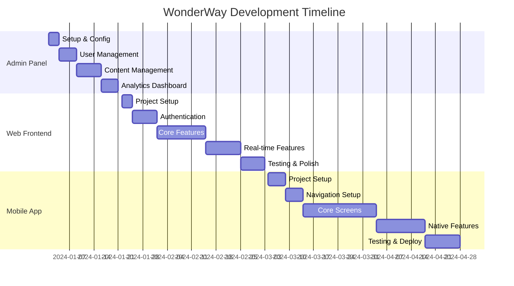

# راهنمای توسعه Frontend و Admin Panel

## مقدمه

این مستند شامل راهنمای کامل توسعه بخشهای مختلف پلتفرم WonderWay شامل Admin Panel، Frontend Web و Mobile App است.

## فهرست مطالب

- [اولویتبندی و استراتژی](#اولویتبندی-و-استراتژی)
- [Admin Panel](#admin-panel)
- [Frontend Web](#frontend-web)
- [Mobile App](#mobile-app)
- [مقایسه تکنولوژیها](#مقایسه-تکنولوژیها)
- [زمانبندی و منابع](#زمانبندی-و-منابع)
- [معماری کلی](#معماری-کلی)

---

## اولویتبندی و استراتژی

### 🎯 اولویت توسعه

```
Priority 1: Admin Panel     (Weeks 1-3)  ⭐⭐⭐
Priority 2: Frontend Web    (Weeks 4-9)  ⭐⭐
Priority 3: Mobile App      (Weeks 10-17) ⭐
```

### دلایل اولویتبندی

#### چرا Admin Panel اول؟
- **مدیریت محتوا**: کنترل پستها، کاربران، گزارشها
- **مانیتورینگ**: نظارت بر عملکرد سیستم
- **ROI سریع**: امکان مدیریت فوری پلتفرم
- **کم پیچیدگی**: سریعترین بخش برای توسعه

#### چرا Web Frontend دوم؟
- **دسترسی گسترده**: همه کاربران دسترسی دارند
- **SEO**: بهتر از mobile app
- **توسعه سریعتر**: نسبت به mobile app
- **تست آسانتر**: debugging راحتتر

#### چرا Mobile App آخر؟
- **پیچیدگی بالا**: نیاز به تخصص بیشتر
- **زمان بیشتر**: app store approval
- **هزینه اضافی**: developer accounts
- **وابستگی**: نیاز به web version برای تست

---

## Admin Panel

### انتخاب تکنولوژی

**⚠️ نکته مهم**: Admin Panel بخشی از Laravel backend است و مستقیماً با Models کار میکند، نه API.

#### گزینه 1: Laravel Filament (توصیه شده) ⭐

```bash
# نصب در همان پروژه Laravel
cd wonderway-backend
composer require filament/filament
php artisan filament:install --panels
php artisan make:filament-user
```

**مزایا:**
- ✅ کاملاً رایگان
- ✅ یکپارچگی کامل با Laravel Models
- ✅ دسترسی مستقیم به دیتابیس
- ✅ بدون نیاز به API calls
- ✅ Performance بالا

**معایب:**
- ❌ نسبتاً جدید
- ❌ مستندات کمتر از Nova

### معماری صحیح Admin Panel

```
┌─────────────────┐    ┌─────────────────┐
│   Mobile App    │    │   Web Frontend  │
│  (React Native) │    │    (Next.js)    │
└─────────────────┘    └─────────────────┘
         │                       │
         └───────────────────────┼─── API Calls
                                 │
                    ┌─────────────────┐
                    │ Laravel Backend │
                    │                 │
                    │  ┌─────────────┐│
                    │  │Admin Panel  ││ ← Direct Model Access
                    │  │(Filament)   ││   (No API needed)
                    │  └─────────────┘│
                    └─────────────────┘
                                 │
                        ┌─────────────────┐
                        │    Database     │
                        │     (MySQL)     │
                        └─────────────────┘
```

```bash
# نصب (نیاز به لایسنس)
composer require laravel/nova
php artisan nova:install
```

**مزایا:**
- ✅ پشتیبانی رسمی Laravel
- ✅ UI بسیار زیبا
- ✅ مستندات کامل
- ✅ Real-time metrics

**معایب:**
- ❌ هزینه: $199 per project
- ❌ محدودیت لایسنس

#### گزینه 3: Laravel Backpack

**مزایا:**
- ✅ رایگان برای استفاده شخصی
- ✅ قابلیتهای زیاد

**معایب:**
- ❌ UI قدیمیتر
- ❌ پیچیدگی بیشتر

### پیادهسازی Admin Panel

#### 1. نصب و راهاندازی

```bash
# نصب Filament
composer require filament/filament
php artisan filament:install --panels

# ایجاد admin user
php artisan make:filament-user
```

#### 2. ایجاد Resources

```bash
# User Management
php artisan make:filament-resource User --generate

# Post Management  
php artisan make:filament-resource Post --generate

# Community Management
php artisan make:filament-resource Community --generate

# Report Management
php artisan make:filament-resource Report --generate
```

#### 3. Dashboard Widgets

```bash
# آمار کلی
php artisan make:filament-widget StatsOverview --stats-overview

# نمودار کاربران
php artisan make:filament-widget UsersChart --chart

# آخرین فعالیتها
php artisan make:filament-widget LatestActivities
```

#### 4. ساختار فایلها

```
app/Filament/
├── Resources/
│   ├── UserResource.php
│   ├── PostResource.php
│   ├── CommunityResource.php
│   └── ReportResource.php
├── Widgets/
│   ├── StatsOverview.php
│   ├── UsersChart.php
│   └── LatestActivities.php
└── Pages/
    ├── Dashboard.php
    └── Settings.php
```

#### 5. ویژگیهای ضروری

```php
// UserResource.php - مثال
class UserResource extends Resource
{
    protected static ?string $model = User::class;
    
    public static function form(Form $form): Form
    {
        return $form->schema([
            TextInput::make('name')->required(),
            TextInput::make('email')->email()->required(),
            Toggle::make('is_active'),
            Select::make('roles')->relationship('roles', 'name'),
        ]);
    }
    
    public static function table(Table $table): Table
    {
        return $table->columns([
            TextColumn::make('name')->searchable(),
            TextColumn::make('email')->searchable(),
            BooleanColumn::make('is_active'),
            TextColumn::make('created_at')->dateTime(),
        ])->filters([
            Filter::make('active')->query(fn ($query) => $query->where('is_active', true)),
        ]);
    }
}
```

---

## Frontend Web

### انتخاب تکنولوژی

#### گزینه 1: Next.js 14 (توصیه شده) ⭐

```bash
npx create-next-app@latest wonderway-web --typescript --tailwind --eslint --app
```

**مزایا:**
- ✅ SSR/SSG برای SEO
- ✅ Performance بالا
- ✅ Developer Experience عالی
- ✅ Community بزرگ
- ✅ Vercel hosting

**معایب:**
- ❌ Learning curve برای تازهکاران

#### گزینه 2: React + Vite

```bash
npm create vite@latest wonderway-web -- --template react-ts
```

**مزایا:**
- ✅ سرعت build بالا
- ✅ سادگی بیشتر
- ✅ Bundle size کمتر

**معایب:**
- ❌ بدون SSR
- ❌ SEO ضعیفتر

#### گزینه 3: Vue.js + Nuxt

**مزایا:**
- ✅ Learning curve آسانتر
- ✅ SSR built-in

**معایب:**
- ❌ Ecosystem کوچکتر
- ❌ Job market کمتر

### پیادهسازی Frontend Web

#### 1. Setup پروژه

```bash
# ایجاد پروژه
npx create-next-app@latest wonderway-web --typescript --tailwind --eslint --app
cd wonderway-web

# نصب dependencies
npm install axios socket.io-client @tanstack/react-query zustand react-hook-form zod
```

#### 2. ساختار پروژه

```
wonderway-web/
├── app/
│   ├── (auth)/
│   │   ├── login/
│   │   │   └── page.tsx
│   │   └── register/
│   │       └── page.tsx
│   ├── dashboard/
│   │   └── page.tsx
│   ├── profile/
│   │   └── [id]/
│   │       └── page.tsx
│   ├── messages/
│   │   └── page.tsx
│   ├── communities/
│   │   └── page.tsx
│   ├── globals.css
│   ├── layout.tsx
│   └── page.tsx
├── components/
│   ├── ui/
│   │   ├── Button.tsx
│   │   ├── Input.tsx
│   │   └── Modal.tsx
│   ├── forms/
│   │   ├── LoginForm.tsx
│   │   └── PostForm.tsx
│   ├── layout/
│   │   ├── Header.tsx
│   │   ├── Sidebar.tsx
│   │   └── Footer.tsx
│   └── features/
│       ├── posts/
│       ├── messages/
│       └── profile/
├── lib/
│   ├── api.ts
│   ├── socket.ts
│   ├── auth.ts
│   └── utils.ts
├── hooks/
│   ├── useAuth.ts
│   ├── usePosts.ts
│   └── useSocket.ts
├── store/
│   ├── authStore.ts
│   ├── postStore.ts
│   └── uiStore.ts
├── types/
│   └── index.ts
└── styles/
    └── globals.css
```

#### 3. Dependencies اصلی

```json
{
  "dependencies": {
    "next": "14.0.0",
    "react": "18.0.0",
    "react-dom": "18.0.0",
    "typescript": "5.0.0",
    "tailwindcss": "3.3.0",
    "axios": "1.6.0",
    "socket.io-client": "4.7.0",
    "@tanstack/react-query": "5.0.0",
    "zustand": "4.4.0",
    "react-hook-form": "7.47.0",
    "zod": "3.22.0",
    "@headlessui/react": "1.7.0",
    "lucide-react": "0.290.0"
  },
  "devDependencies": {
    "@types/node": "20.0.0",
    "@types/react": "18.0.0",
    "eslint": "8.0.0",
    "eslint-config-next": "14.0.0",
    "autoprefixer": "10.0.0",
    "postcss": "8.0.0"
  }
}
```

#### 4. کد نمونه

```typescript
// lib/api.ts
import axios from 'axios';

const api = axios.create({
  baseURL: process.env.NEXT_PUBLIC_API_URL || 'http://localhost:8000/api',
});

api.interceptors.request.use((config) => {
  const token = localStorage.getItem('token');
  if (token) {
    config.headers.Authorization = `Bearer ${token}`;
  }
  return config;
});

export default api;

// hooks/useAuth.ts
import { create } from 'zustand';
import api from '@/lib/api';

interface AuthState {
  user: User | null;
  token: string | null;
  login: (email: string, password: string) => Promise<void>;
  logout: () => void;
}

export const useAuth = create<AuthState>((set) => ({
  user: null,
  token: null,
  login: async (email, password) => {
    const response = await api.post('/login', { email, password });
    const { user, token } = response.data.data;
    localStorage.setItem('token', token);
    set({ user, token });
  },
  logout: () => {
    localStorage.removeItem('token');
    set({ user: null, token: null });
  },
}));
```

---

## Mobile App

### انتخاب تکنولوژی

#### گزینه 1: React Native + Expo (توصیه شده) ⭐

```bash
npx create-expo-app wonderway-mobile --template
```

**مزایا:**
- ✅ Cross-platform (iOS + Android)
- ✅ Hot reload
- ✅ OTA updates
- ✅ Rich ecosystem
- ✅ Easy deployment

**معایب:**
- ❌ Performance محدود
- ❌ وابستگی به Expo services

#### گزینه 2: Flutter

```bash
flutter create wonderway_mobile
```

**مزایا:**
- ✅ Performance بالا
- ✅ UI consistency
- ✅ Google backing

**معایب:**
- ❌ Dart language
- ❌ Learning curve بالا
- ❌ Ecosystem کوچکتر

#### گزینه 3: Native Development

**مزایا:**
- ✅ Performance بهترین
- ✅ دسترسی کامل به platform

**معایب:**
- ❌ دو codebase جداگانه
- ❌ هزینه توسعه بالا
- ❌ زمان بیشتر

### پیادهسازی Mobile App

#### 1. Setup پروژه

```bash
# ایجاد پروژه Expo
npx create-expo-app wonderway-mobile --template
cd wonderway-mobile

# نصب dependencies
npx expo install @react-navigation/native @react-navigation/stack
npx expo install expo-notifications expo-camera expo-image-picker
npm install axios socket.io-client zustand react-query
```

#### 2. ساختار پروژه

```
wonderway-mobile/
├── src/
│   ├── screens/
│   │   ├── Auth/
│   │   │   ├── LoginScreen.tsx
│   │   │   └── RegisterScreen.tsx
│   │   ├── Home/
│   │   │   ├── HomeScreen.tsx
│   │   │   └── TimelineScreen.tsx
│   │   ├── Profile/
│   │   │   ├── ProfileScreen.tsx
│   │   │   └── EditProfileScreen.tsx
│   │   ├── Messages/
│   │   │   ├── MessagesScreen.tsx
│   │   │   └── ChatScreen.tsx
│   │   └── Communities/
│   │       └── CommunitiesScreen.tsx
│   ├── components/
│   │   ├── ui/
│   │   ├── forms/
│   │   └── layout/
│   ├── navigation/
│   │   ├── AppNavigator.tsx
│   │   ├── AuthNavigator.tsx
│   │   └── TabNavigator.tsx
│   ├── services/
│   │   ├── api.ts
│   │   ├── socket.ts
│   │   └── notifications.ts
│   ├── hooks/
│   │   ├── useAuth.ts
│   │   └── usePosts.ts
│   ├── store/
│   │   └── index.ts
│   ├── utils/
│   │   └── helpers.ts
│   └── types/
│       └── index.ts
├── assets/
│   ├── images/
│   └── icons/
├── App.tsx
├── app.json
└── package.json
```

#### 3. Dependencies اصلی

```json
{
  "dependencies": {
    "expo": "~49.0.0",
    "react": "18.2.0",
    "react-native": "0.72.0",
    "@react-navigation/native": "6.1.0",
    "@react-navigation/stack": "6.3.0",
    "@react-navigation/bottom-tabs": "6.5.0",
    "expo-notifications": "~0.20.0",
    "expo-camera": "~13.4.0",
    "expo-image-picker": "~14.3.0",
    "expo-av": "~13.4.0",
    "react-native-reanimated": "~3.3.0",
    "react-native-gesture-handler": "~2.12.0",
    "axios": "1.6.0",
    "socket.io-client": "4.7.0",
    "zustand": "4.4.0",
    "@tanstack/react-query": "5.0.0"
  }
}
```

#### 4. کد نمونه

```typescript
// src/navigation/AppNavigator.tsx
import { NavigationContainer } from '@react-navigation/native';
import { createStackNavigator } from '@react-navigation/stack';
import { useAuth } from '@/hooks/useAuth';
import AuthNavigator from './AuthNavigator';
import TabNavigator from './TabNavigator';

const Stack = createStackNavigator();

export default function AppNavigator() {
  const { user } = useAuth();

  return (
    <NavigationContainer>
      <Stack.Navigator screenOptions={{ headerShown: false }}>
        {user ? (
          <Stack.Screen name="Main" component={TabNavigator} />
        ) : (
          <Stack.Screen name="Auth" component={AuthNavigator} />
        )}
      </Stack.Navigator>
    </NavigationContainer>
  );
}

// src/services/notifications.ts
import * as Notifications from 'expo-notifications';
import { Platform } from 'react-native';

export async function registerForPushNotifications() {
  let token;
  
  if (Platform.OS === 'android') {
    await Notifications.setNotificationChannelAsync('default', {
      name: 'default',
      importance: Notifications.AndroidImportance.MAX,
    });
  }

  const { status: existingStatus } = await Notifications.getPermissionsAsync();
  let finalStatus = existingStatus;
  
  if (existingStatus !== 'granted') {
    const { status } = await Notifications.requestPermissionsAsync();
    finalStatus = status;
  }
  
  if (finalStatus !== 'granted') {
    throw new Error('Permission not granted for push notifications');
  }
  
  token = (await Notifications.getExpoPushTokenAsync()).data;
  return token;
}
```

---

## مقایسه تکنولوژیها

### جدول مقایسه کامل

| معیار | Filament | Nova | Next.js | React Native | Flutter |
|-------|----------|------|---------|--------------|---------|
| **هزینه** | رایگان | $199 | رایگان | رایگان | رایگان |
| **Learning Curve** | آسان | آسان | متوسط | متوسط | سخت |
| **Performance** | عالی | عالی | عالی | خوب | عالی |
| **Community** | رو به رشد | قوی | بسیار قوی | قوی | رو به رشد |
| **Documentation** | خوب | عالی | عالی | عالی | عالی |
| **Maintenance** | آسان | آسان | متوسط | متوسط | متوسط |

### امتیازدهی (از 10)

| تکنولوژی | کیفیت | سرعت توسعه | هزینه | نگهداری | جمع |
|-----------|--------|-------------|-------|----------|-----|
| **Filament** | 9 | 9 | 10 | 8 | 36 |
| **Nova** | 10 | 9 | 6 | 9 | 34 |
| **Next.js** | 9 | 8 | 10 | 8 | 35 |
| **React Native** | 7 | 8 | 10 | 7 | 32 |
| **Flutter** | 8 | 6 | 10 | 7 | 31 |

---

## زمانبندی و منابع

### تایم لاین توسعه



### تخمین ساعات کاری

#### Admin Panel (120 ساعت)
- **Setup & Configuration**: 20 ساعت
- **User Management**: 30 ساعت
- **Content Management**: 40 ساعت
- **Analytics & Reports**: 30 ساعت

#### Web Frontend (200 ساعت)
- **Project Setup**: 15 ساعت
- **Authentication System**: 35 ساعت
- **Core Features**: 80 ساعت
- **Real-time Features**: 40 ساعت
- **Testing & Polish**: 30 ساعت

#### Mobile App (280 ساعت)
- **Project Setup**: 25 ساعت
- **Navigation & Structure**: 30 ساعت
- **Core Screens**: 120 ساعت
- **Native Features**: 70 ساعت
- **Testing & Deployment**: 35 ساعت

### تیم مورد نیاز

#### حداقل تیم
- **1 Full-stack Developer** (شما)
- **1 Frontend Developer** (React/Next.js)
- **1 UI/UX Designer**

#### تیم ایدهآل
- **1 Backend Developer** (Laravel)
- **1 Frontend Developer** (React/Next.js)
- **1 Mobile Developer** (React Native)
- **1 UI/UX Designer**
- **1 DevOps Engineer**

### بودجه تخمینی

#### هزینههای توسعه
- **Laravel Nova**: $199 (اختیاری)
- **Apple Developer Account**: $99/year
- **Google Play Console**: $25 one-time
- **Domain & SSL**: $50/year
- **Hosting**: $100-500/month

#### هزینههای تیم (ماهانه)
- **Frontend Developer**: $3000-5000
- **Mobile Developer**: $3500-6000
- **UI/UX Designer**: $2500-4000
- **DevOps Engineer**: $4000-7000

---

## معماری کلی

### نمودار معماری

```
┌─────────────────┐    ┌─────────────────┐    ┌─────────────────┐
│   Mobile App    │    │   Web Frontend  │    │   Admin Panel   │
│  (React Native) │    │    (Next.js)    │    │   (Filament)    │
└─────────────────┘    └─────────────────┘    └─────────────────┘
         │                       │                       │
         └───────────────────────┼───────────────────────┘
                                 │
                    ┌─────────────────┐
                    │   API Gateway   │
                    │   (Laravel)     │
                    └─────────────────┘
                                 │
         ┌───────────────────────┼───────────────────────┐
         │                       │                       │
┌─────────────────┐    ┌─────────────────┐    ┌─────────────────┐
│     Database    │    │      Redis      │    │   File Storage  │
│     (MySQL)     │    │    (Cache)      │    │      (S3)       │
└─────────────────┘    └─────────────────┘    └─────────────────┘
```

### Data Flow

```
User Action → Frontend → API → Business Logic → Database → Response → Frontend → UI Update
```

### Real-time Communication

```
Client ←→ WebSocket Server ←→ Redis Pub/Sub ←→ Laravel Events
```

---

## نتیجهگیری و توصیهها

### توصیه نهایی

1. **شروع با Admin Panel** (Filament)
2. **توسعه Web Frontend** (Next.js)
3. **پیادهسازی Mobile App** (React Native + Expo)

### نکات مهم

- **MVP First**: ابتدا حداقل ویژگیها را پیادهسازی کنید
- **Progressive Enhancement**: به تدریج ویژگیها را اضافه کنید
- **User Feedback**: از بازخورد کاربران استفاده کنید
- **Performance Monitoring**: عملکرد را مداوم نظارت کنید

### مراحل بعدی

1. **Setup Development Environment**
2. **Create Project Repositories**
3. **Design System & UI Kit**
4. **API Integration Planning**
5. **Testing Strategy**
6. **Deployment Pipeline**

این رویکرد تضمین میکند که پلتفرم WonderWay با کیفیت بالا و در زمان مناسب توسعه یابد.